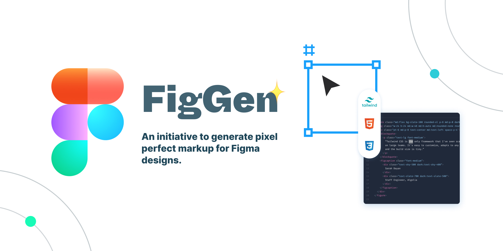

# FigGen

An initiative to generate pixel perfect markup for Figma designs.

## Demo Preview

## Download

[Download FigGen from Figma Community](https://www.figma.com/community/plugin/1065278044402066626)

## Features

* Utility first approach to generate pixel perfect markup for Figma designs.
* Built for future, uses flex and respects item spacing
* No clumsy/frugal code with absolutely positioned elements
* Uses tailwind 3.0
* Export assets to zip with a click
* Handles auto layout and its constraints (better design scalability for both designers and developers)
* Option to mark exportable assets in your preferred format from Figma itself
* Handles most common usecases like borders, shadows, background colors, text styles, etc.

## Usage

Figma to code conversion is no rocket science, but for pixel perfect UI, we have to do some pre-processing to unfold the magic. Let’s look at some ways to achieve accurate results:

* Download FigGen from Figma Plugin Marketplace and run it on the desired UI.
* Ensure that the frames have auto layout. It helps us to parse your Design better and also good for scaling designs in long term.
* Mark the image/icon layers for export in the desirable format. We will import the asset in the selected format for you.
* Avoid the use of Fixed Height/Width constraints as much as possible. Nearly same results can be achieved using ‘Fill container’/’Hug contents’ constraint.

## Installation (Development)

* Make sure you've installed Figma app.
* Import FigGen project in Figma by pointing to the repository directory.
* Run npn/yarn install in the project
* Run yarn dev for development mode.

# FigGen MVP project roadmap

 * [x] Module bundler setup
 * [x] UI setup with vanilla implementation
 * [x] Plugin UI for generating markup
 * [x] Analyze technical feasibility of Figma APIs
 * [x] Special handling for images
 * [x] Zipped exports
 * [x] Ability to parse Figma frame data.
 * [x] Receive plugin input from users for export/format keywords
 * [x] Generate equivalent markup for auto-layout components

## Future improvements

 * [ ] Better Responsiveness overall
 * [ ] Better Documentation and add comments to the code
 * [ ] Handle semantics - Input fields, containers, buttons, links, etc.
 * [ ] Support for Masks/Clipping/Stroke Properties
 * [ ] Variant processing via special keywords/naming convention
 * [ ] and much more that I forgot 

